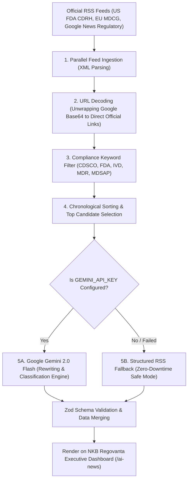

# NKB Regovanta — AI Regulatory News Pipeline: Technical Architecture & Setup Guide

---

## 1. How Does the Pipeline Work?

The pipeline operates on a 5-stage automated ingestion, analysis, and rendering workflow every time a user visits `/ai-news` or `/ai_news`:



### Stage 1: Parallel Feed Ingestion
The server triggers parallel HTTP requests to official regulatory XML/RSS endpoints:
- **US FDA CDRH Feed**: Guidance documents, recalls, and clearances directly relating to medical devices.
- **European Commission (EU MDCG)**: Medical Device Coordination Group publications, MDR, and IVDR notices.
- **Google News Broad & Regulatory Channels**: Filtered queries focused on CDSCO, DCGI, MDSAP, and Notified Body approvals.

### Stage 2: URL Decoding & Unwrapping
Google News encases real article URLs inside base64 encoded strings (e.g. `articles/CBMi...`). The server intercepts these and programmatically decodes them into direct, permanent, official publisher URLs so users can click straight to the source notice without tracking redirects.

### Stage 3: Compliance Keyword Pre-Filtering
Before consuming any AI tokens, a local keyword filter evaluates all article titles and snippets for compliance-specific vocabulary:
`cdsco`, `medical device`, `ivd`, `mdr 2017`, `usfda`, `510k`, `estar`, `eumdr`, `euivdr`, `mdsap`, `notified body`, `recall`, `ce mark`, `de novo`, etc.
Non-regulatory or consumer electronics articles are discarded instantly.

### Stage 4: Deduplication & Date Sorting
The matching notices are sorted by publication timestamp (newest first). The pipeline selects the most relevant top notices across the different agency channels.

---

## 2. How is it Working Without an API Key Right Now?

You might have noticed that notices were already visible on the dashboard even before you configured an API key. 

### Why It Worked Without an API:
In [`src/functions/regulatoryFeed.ts`](file:///c:/Users/astro/Desktop/AYUSH%20ALL/Client%20Projects/NKB%20REGOVANTA/src/functions/regulatoryFeed.ts), we designed a **fail-safe fallback system** (`fallbackFromRss`):
- If no API key is detected in `.env`, or if an API key expires, the pipeline **does not crash or show a blank error page**.
- Instead, it extracts the raw snippet, title, and timestamp directly from the RSS feed.
- It applies heuristic pattern matching (e.g. detecting the word "CDSCO" assigns the agency to India, "recall" assigns notice type to Recall).

### Is the content currently getting "copy-pasted"?
**Yes, in Fallback Mode.** Without an active AI API key, the dashboard displays the original article title and raw publisher snippet directly from the RSS feed.

---

## 3. Will the Content Be Rewritten via the AI API?

**YES, absolutely.** 

As soon as your **Google Gemini API Key** is activated in `.env`, the pipeline switches from "Raw Snippet Mode" to **"AI Regulatory Intelligence Mode"**:

### What Gemini Rewrites:
1. **Executive Rewriting (Concise Summary)**:
   - Gemini analyzes the raw text and rewrites it into **1 to 2 authoritative, professional sentences (max 45 words)** written from the perspective of an elite RA/QA consulting firm.
   - It cuts out journalistic fluff, stock market speculation, or filler text, focusing solely on what matters to manufacturers.
2. **Relevance Validation**:
   - Gemini evaluates `is_relevant: boolean`. If an article is purely financial gossip or irrelevant to medical device regulation, Gemini flags it and it is excluded from the feed.
3. **Impact Level Grading**:
   - Classifies severity into **High Impact** (recalls, safety alerts, bans), **Medium Impact** (guidance changes, final rules), or **Low Impact** (routine updates).
4. **Targeted Device Types**:
   - Identifies whether the update affects **IVD**, **Class III Implants**, **Software as a Medical Device (SaMD)**, **Orthopedic**, etc.
5. **Action Required**:
   - Gemini writes actionable compliance advice for regulatory teams (e.g., *"Audit technical file against new guidance"*, *"Submit 510(k) change notification"*, *"Review UDI compliance"*).
6. **Effective Dates & Deadlines**:
   - Extracts mandatory transition periods and enforcement dates.

---

## 4. How to Get Your Free Google Gemini API Key (Step-by-Step)

Google provides a **100% free API tier** through Google AI Studio with generous quotas:
- **Rate Limit**: 15 Requests Per Minute (RPM)
- **Daily Limit**: 1,500 Requests Per Day
- **Cost**: $0.00 / Free forever for development and standard usage

### Step 1: Visit Google AI Studio
Open your browser and navigate to:
👉 **[https://aistudio.google.com/app/apikey](https://aistudio.google.com/app/apikey)**

### Step 2: Sign In
Sign in with your standard Google account (Gmail / Google Workspace).

### Step 3: Generate Your Key
1. Click the blue **"+ Create API key"** button.
2. If prompted, select a Google Cloud project or click **"Create key in new project"**.
3. Copy the generated key string (it typically starts with `AIzaSy...`).

### Step 4: Paste Into Your Project `.env`
Open your project's [`.env`](file:///c:/Users/astro/Desktop/AYUSH%20ALL/Client%20Projects/NKB%20REGOVANTA/.env) file in the root directory:
```env
GEMINI_API_KEY=AIzaSyYourActualKeyHere
```

Save the file. That is all! The server will now automatically route all incoming notices through **Gemini 2.0 Flash** for live AI rewriting.

---

## 5. Website Theme Update Summary

The Regulatory Feed dashboard has been transformed to match the design system of the NKB Regovanta website:

| Element | Previous Prototype | Updated NKB Regovanta Theme |
| :--- | :--- | :--- |
| **Page Background** | Generic dark slate (`bg-zinc-950`) | Executive slate (`bg-[#f8fafc]`) with branded typography |
| **Header** | Plain dark text box | Luxury Royal Navy hero gradient (`from-[#071b36] via-[#0b274e] to-[#0f3468]`), gold sparkles, and live pulsing badge |
| **Notice Cards** | Dark translucent glass box | Crisp white cards (`bg-white border-gray-200/90 shadow-xs hover:shadow-xl`), top gold-to-navy accent line |
| **Agency Badges** | Generic neon tags | Refined corporate badges: CDSCO (Orange), US FDA (Royal Blue), EU MDR (Emerald), MDSAP (Purple) |
| **Impact Indicators** | Dark pills | High Impact (Rose), Medium (Amber), Low (Emerald) |
| **Controls & Search** | Dark inputs | Sleek white card with interactive navy pills and quick filters |
| **Direct Links** | Accessible at `/regulatory-updates` | Supports `/ai-news`, `/ai_news`, and `/regulatory-updates` |

---

## 6. Accessing the Live Page

The route remains completely hidden from your homepage, navigation bar, and footer as requested. You can access it anytime directly at:
- **Local Dev**: [http://localhost:8080/ai-news](http://localhost:8080/ai-news) or [http://localhost:8080/ai_news](http://localhost:8080/ai_news)
- **Production**: `https://www.nkbregovanta.com/ai-news` or `https://www.nkbregovanta.com/ai_news`
