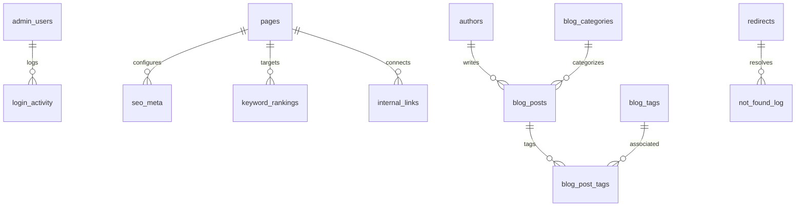

# NKB Regovanta - Supabase Backend Architecture & Developer Learning Guide

This document explains the technical implementation of the Supabase backend for NKB Regovanta, why each architectural choice was made, and the core concepts behind modern web application persistence and security.

---

## 1. Why Supabase? (And Why Not Local SQLite)

### The Problem With Local File Databases in Modern Web Hosting
When a website is hosted on modern cloud platforms like Vercel, Netlify, or AWS Lambda, the server runs in **serverless functions** or **containers**.
- **Ephemeral Filesystem:** Every time you deploy new code or the server spins down when idle, the local hard drive is wiped clean and replaced with a fresh copy of your code.
- If you use a local SQLite file (e.g. `nkb_seo.sqlite`), every article you write or redirect you add would vanish on the very next git push or container recycle!
- Furthermore, serverless functions run across multiple edge regions. Two users visiting the site would read two different files that cannot talk to each other.

### The Supabase Solution
Supabase provides a **hosted, serverless-ready PostgreSQL database** in the cloud.
- **Persistent Cloud Storage:** Your data lives safely on dedicated PostgreSQL instances with automated backups, surviving deployments and server restarts.
- **RESTful API via PostgREST:** Supabase automatically exposes a clean, fast API over HTTP without having to build and maintain separate Express/FastAPI microservices.
- **Instant Global Latency:** Can be queried both from the browser (React frontend) and from the edge server (`src/server.ts`).

---

## 2. Database Schema Architecture

The database schema (`supabase/setup_complete.sql`) defines **20 relational tables** organized into 4 functional domains:



### 2.1 Domain 1: Authentication & Access
1. **`admin_users`**: Stores admin profiles, email, username, PBKDF2 password hash, and salt.
2. **`admin_sessions`**: Stores active login session tokens, expiration timestamps, and user agent info.
3. **`login_activity`**: Audit trail of successful and failed login attempts. Used by the security engine to enforce the **5-failed-attempts 15-minute lockout**.

### 2.2 Domain 2: SEO Management
4. **`pages`**: Registry of every route on the website (267 seeded routes) with status, H1, and sitemap inclusion flag.
5. **`seo_meta`**: Stores SEO title, meta description, canonical URL, and robots directive (`index`/`noindex`, `follow`/`nofollow`).
6. **`keywords`**: Central bank of target regulatory keywords.
7. **`keyword_rankings`**: Page-to-keyword mappings, checking if the keyword is present in Title, H1, and URL.
8. **`redirects`**: Manages 301 and 302 redirects with automatic loop detection, active toggle, and hit counter.
9. **`schema_data`**: JSON-LD structured data for FAQPage, Organization, and Service schemas.
10. **`image_assets`**: Tracks image ALT tags, decorative flags, dimensions, and file size warnings.
11. **`internal_links`**: Graph of source-to-target links with anchor text and orphan page detection.
12. **`broken_links`**: Discovered 404 links across pages with status and repair suggestions.
13. **`not_found_log`**: Real-time log of 404 requests from live visitors with referrer, user agent, and IP.

### 2.3 Domain 3: Regulatory Blog / Insights System
14. **`authors`**: Bio, photo, credentials, and role for regulatory consultants (vital for Google E-E-A-T score).
15. **`blog_categories`**: Category taxonomy (e.g. *EU MDR*, *US FDA*, *CDSCO India*) with slug-change 301 safeguards.
16. **`blog_tags`**: Tag taxonomies with `is_indexable` flag (default `false` to avoid thin tag archives).
17. **`blog_posts`**: Main article storage with HTML body, featured image, status (`draft`, `published`, `scheduled`, `trash`), IST publish date, and 30-day trash retention.
18. **`blog_post_tags`**: Many-to-many junction table connecting posts and tags.

### 2.4 Domain 4: Site Configuration & Auditing
19. **`settings`**: Key-value pairs for site suffix, GA4 ID, GTM ID, Google Search Console tag, timezone, and active robots.txt.
20. **`robots_versions`**: 5-version history of `robots.txt` changes with author tracking and 1-click restore.

---

## 3. Security Engineering: Passwords, Salt & PBKDF2

### Why Not Plain MD5 or SHA-256?
Plain hashing algorithms (like MD5 or plain SHA-256) can be cracked in seconds using "rainbow tables" (precomputed dictionaries of hashes).

### The PBKDF2 Implementation (`src/server/auth/crypto.ts`)
To protect admin credentials with military-grade defense:
1. **Cryptographic Salt (64 characters):** Every user is assigned a unique, cryptographically random salt (`crypto.randomBytes(32)`).
2. **100,000 Iterations of SHA-512:** PBKDF2 (Password-Based Key Derivation Function 2) runs the hashing function 100,000 times consecutively.
3. This creates **computational friction** for attackers: while verifying one password takes 50 milliseconds for an authorized user, brute-forcing 1,000,000 passwords would take decades for an attacker.

---

## 4. How Frontend & SSR Connect to Supabase

### 4.1 The Supabase Client (`src/lib/supabase.ts`)
The application instantiates the Supabase client using environment variables:
```typescript
import { createClient } from "@supabase/supabase-js";

const supabaseUrl = process.env["VITE_SUPABASE_URL"] || "https://zoihnehiptkfgxshtazi.supabase.co";
const supabaseAnonKey = process.env["VITE_SUPABASE_PUBLISHABLE_KEY"] || "sb_publishable__z_p_rRZhkKbuZ0O8tHRsg_ijkdLGoP";

export const supabase = createClient(supabaseUrl, supabaseAnonKey);
```

### 4.2 Row Level Security (RLS)
PostgreSQL supports Row Level Security (RLS). This means the database itself decides whether a query is allowed:
- Public queries (e.g. reading published blog posts, active redirects, or site settings) are permitted for everyone.
- Modifying settings or writing articles requires authenticated admin rights.

### 4.3 Server-Side Interception (`src/server.ts`)
When a visitor or Googlebot requests a URL, `src/server.ts` intercepts the request before it reaches React:
1. **Dynamic Redirects:** Checks if the requested URL exists in `redirects`. If active, it instantly returns an HTTP 301/302 redirect and increments the hit counter in the background.
2. **Dynamic Robots.txt:** Serves `/robots.txt` directly from `site_settings.robots_txt`.
3. **Dynamic XML Sitemaps:** Generates `/sitemap.xml`, `/sitemap-pages.xml`, and `/sitemap-posts.xml` dynamically from the database.
4. **Admin Protection:** Injects `X-Robots-Tag: noindex, nofollow, noarchive` on all `/admin/*` routes to guarantee the admin portal is never indexed by Google.
5. **Dynamic Head Tag Injection:** If a page's SEO title or meta description was edited in the Admin Panel, `src/server.ts` replaces the `<title>` and `<meta name="description">` in the server-rendered HTML so Google crawlers see the updated metadata immediately!

---

## 5. How to Run the Setup Script in Supabase

To initialize all 20 tables, indexes, constraints, 267 pages, and 32 regulatory articles:

1. Open your browser and log into [Supabase Dashboard](https://supabase.com/dashboard).
2. Open your project: `zoihnehiptkfgxshtazi`.
3. In the left navigation menu, click the **SQL Editor** icon (`>_`).
4. Click **New query**.
5. Open [`supabase/setup_complete.sql`](file:///c:/Users/astro/Desktop/AYUSH%20ALL/Client%20Projects/NKB%20REGOVANTA/supabase/setup_complete.sql) in your code editor, copy its entire contents, and paste it into the Supabase SQL Editor.
6. Click the green **Run** button (or press `Ctrl + Enter`).
7. You will see:
   `Success. No rows returned` (or row counts confirmed).
8. Click **Table Editor** on the left menu: you will see all 20 tables created with all seeded pages and articles ready to use!

---

## 6. Verification and Test Results

The backend implementation was validated through automated tests:
1. `node scripts/test_admin_system.cjs` (8/8 tests passed):
   - PBKDF2 hashing & deterministic salt verification
   - 5-attempt lockout enforcement
   - Self-redirect and circular loop prevention
   - Robots.txt `Disallow: /` deindex warning
   - SERP character count thresholds
   - Primary keyword collision detection
   - Sitemap XML structure compliance
   - Admin user retention safeguards
2. `npm run test:seo` (7/7 tests passed):
   - Canonical URL consistency
   - Multi-bot exclusion rules
   - Multiline route sitemap survival
3. `npm run prebuild` (Clean pass):
   - Static sitemap generated: 231 indexable URLs
   - SEO check: 265 pages validated
   - TypeScript compilation: 0 errors (`tsc --noEmit`)
